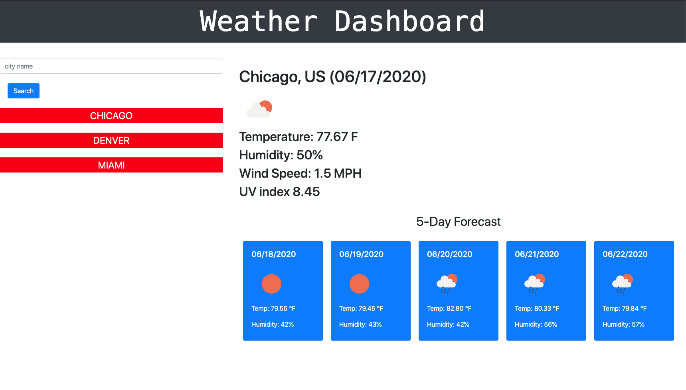

# weather-dashboard
Weather app that uses [OpenWeather API](https://openweathermap.org/api) to retrieve data for multiple cities, then stores that info in localStorage
https://cd-prog.github.io/weather-dashboard/

